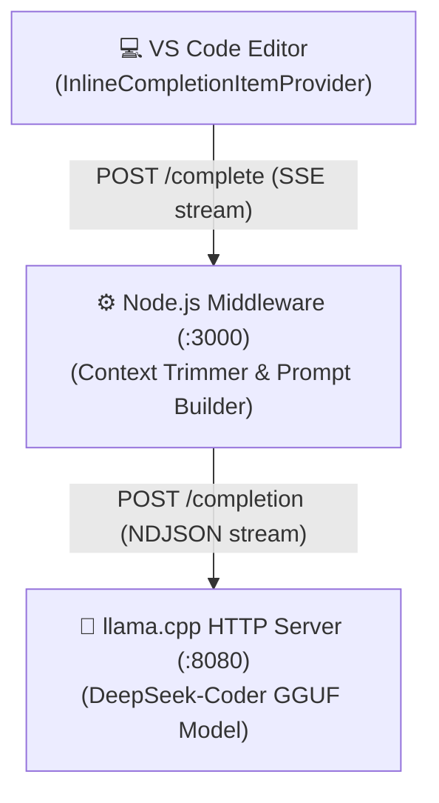

<div align="center">
  <h1>✨ Wisp</h1>
  <p><b>A production-quality, self-hosted GitHub Copilot alternative.</b></p>
  <p>Runs entirely offline on your CPU using <i>llama.cpp</i>, a Node.js middleware, and a VS Code extension.</p>
</div>

<div align="center">
  
  [](#)
  [](#)
  [](#)
  
</div>

---

## ⚡ Quick Start (Automated Installation)

The easiest way to get Wisp up and running is to use our provided 1-click installation scripts. This will automatically download and compile `llama.cpp`, grab the recommended language model, and build the middleware and VS Code extension.

### 🐧 Linux & 🍎 macOS
```bash
chmod +x install.sh
./install.sh
```

### 🪟 Windows *(Experimental)*
Open PowerShell and run:
```powershell
.\install.ps1
```

> **Note:** The automated installation scripts will place the DeepSeek-Coder 6.7B Q4_K_M model inside the `./models` directory and assume you have standard toolchains installed (`git`, `cmake`, `python`, `npm`).

Once the installation is complete, you can start the Wisp backend services natively:
```bash
./start.sh
```

*(For Windows users, please start the `llama.cpp` and Node middleware manually as referenced below if a native `start.ps1` is not available).*

---

## 🛠️ Manual Setup

If you prefer to set up Wisp manually instead of using the automated scripts, follow these steps.

### 1. Setup — `llama.cpp`

**Build:**
```bash
git clone https://github.com/ggerganov/llama.cpp
cd llama.cpp
cmake -B build -DLLAMA_NATIVE=ON
cmake --build build --config Release -j$(nproc)
```

**Download Model (DeepSeek-Coder 6.7B Q4_K_M recommended):**
```bash
pip install huggingface_hub
~/.local/bin/huggingface-cli download \
  TheBloke/deepseek-coder-6.7B-instruct-GGUF \
  deepseek-coder-6.7b-instruct.Q4_K_M.gguf \
  --local-dir ./models
```
> Lighter alternatives: `starcoder2-3b-Q4_K_M.gguf` (fast), `codellama-7b.Q4_K_M.gguf`

**Start the Server:**
```bash
./build/bin/llama-server \
  -m ./models/deepseek-coder-6.7b-instruct.Q4_K_M.gguf \
  -c 4096 \
  --threads 8 \
  --parallel 4 \
  --port 8080 \
  --host 127.0.0.1 \
  --batch-size 512 \
  --mlock \
  --no-mmap \
  --log-disable
```

### 2. Setup — Middleware

```bash
cd middleware
npm install
npm run dev          # development with hot reload
# OR
npm run build && npm start   # production
```

Environment variables (optional):

| Variable | Default | Description |
|----------|---------|-------------|
| `LLAMA_URL` | `http://127.0.0.1:8080` | llama.cpp server URL |
| `MODEL_FAMILY` | `deepseek` | Prompt format: `deepseek`, `codellama`, `starcoder`, `generic` |
| `PORT` | `3000` | Middleware listening port |

### 3. Setup — VS Code Extension

```bash
cd vscode-extension
npm install
npm run compile
```
*To test*, press <kbd>F5</kbd> in VS Code to launch the Extension Development Host, or run `vsce package` to bundle and use `code --install-extension <name>.vsix`.

---

## 🏗️ Architecture



---

## 🧠 Prompt Engineering Details

### Why FIM (Fill-In-the-Middle)?
Standard left-to-right generation only sees context before the cursor. FIM gives the model both prefix **AND** suffix, so it:
1. Knows what comes after the cursor and won't duplicate it.
2. Produces completions that fit naturally into the surrounding code.
3. Mimics the same technique used by GitHub Copilot and Cursor.

DeepSeek-Coder FIM format:
```
<｜fim▁begin｜>{prefix}<｜fim▁hole｜>{suffix}<｜fim▁end｜>
```

### Generation Settings
* **Temperature 0.15**: Code completion is precision-driven. Greedy decoding (`temp=0.0`) can loop; `0.15` offers slight diversity to escape local optima without generating hallucinated syntax.
* **Max Tokens 64**: Inline completions should finish one logical unit (a function call argument, an `if` block). 64 tokens (~48 characters) is optimal. Longer generation increases latency 3-5x and is rarely accepted by the user entirely.

---

## 🚀 Performance Tuning

- **Context trimming (`trimmer.ts`)**: Capped at 100 lines prefix, 30 lines suffix. Every extra token adds latency.
- **Debouncing (`extension.ts`)**: 300ms cooldown. Prevents triggering completions on every keystroke.
- **Prompt Caching (`cache.ts` & `llama.cpp`)**: `cache_prompt: true` inside llama.cpp ensures KV cache is reused for repeated prefixes. This is the **single biggest latency win**.
- **Thread Tuning**: Set `--threads` equal to your *physical* cores (e.g., a 4-core/8-hyperthread CPU = `4`).

| Model Size | Quantization | First Token | Full 64-token |
|------------|--------------|-------------|---------------|
| 3B | Q4_K_M | ~80ms | ~400ms |
| 6.7B | Q4_K_M | ~180ms | ~900ms |
| 7B | Q4_K_M | ~200ms | ~1000ms |
| 33B | Q4_K_M | ~800ms | ~4500ms |

---

## 📂 Project Structure

```text
wisp/
├── install.sh                       ← Automated Linux setup
├── install.ps1                      ← Automated Windows setup
├── start.sh                         ← Service starter script
├── README.md                        ← This documentation
├── middleware/
│   ├── src/
│   │   ├── index.ts                 ← Express server, routing
│   │   ├── completer.ts             ← llama.cpp SSE client
│   │   ├── promptBuilder.ts         ← FIM prompt construction
│   │   ├── trimmer.ts               ← Context window limiter
│   │   └── cache.ts                 ← LRU prompt cache
└── vscode-extension/
    └── src/
        └── extension.ts             ← Provides autocomplete UI logic
```

---

## 🤝 Contributing

**Please feel free to contribute!** Wisp is an open-source project that currently needs a lot of help to reach its full potential. This project can be 100 times better than it is right now. 

Whether you are fixing bugs, optimizing inference performance, or adding new features, all contributions are highly appreciated! Please review our [Contributing Guidelines](CONTRIBUTING.md) before submitting (remember to keep your PRs neat and attach proofs of your changes).
